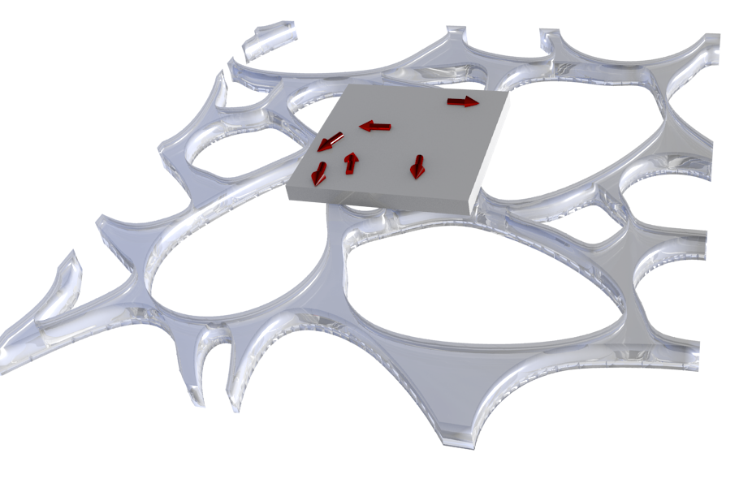

# Specimen Generator

Generate specimens manually using 3D modelling, or procedurally generate random specimens.

Currently working in Blender 2.78a. It should work with newer versions of Blender, but usage of the ray_cast() algorithm changed at some point, so this will not work with earlier versions without altering a line in PointsInsideMesh(). For such versions, change `result, location, normal, index = ob.ray_cast(orig, axis * 10000.0)` to `location,normal,index = ob.ray_cast(orig,axis*10000.0)`.

## `random.py`

Procedurally generates specimen simulations. Requires Blender to run. Open file inside Blender, set output_path, and run. It might be possible to run this outside Blender, but I haven't tried it. Blender is free and easy to install, and contains all required packages. Output format is a text file with each block of rows/columns representing a 2D slice of the binary specimen mask. Each block is separated by an empty line. 

This produces specimen files that are compatible with [phase-ret-dl](https://github.com/zac-k/phase-ret-dl), which uses these files to simulate electron micrographs and train a neural network.

## `vecfield.py`

Generate a binary specimen mask file, and a file for each of the three components of the magnetisation.

I suggest to use the included `example.blend` to begin with. Note that this file also contains the script, which should work, but might be out-of-date compared to the one directly in this repository.

The vector field is produced based on what is selected, and the mask is produced by object name:
* Open the `.blend` file in Blender. 
* Set the desired output path. 
* Select all vector objects. 
* Ensure that the name of the specimen object is consistent with that in the script. 
* Run.

